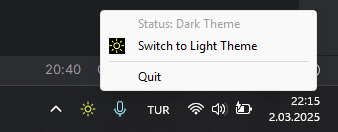

<h1>Luminous</h1>

Switch between Light and Dark themes on Windows with a single click!

## About

Luminous is a lightweight system tray application for Windows that allows you to toggle between Light and Dark themes instantly. Built with **Go** for performance and simplicity, it integrates seamlessly with the Windows operating system.

## Features

- Toggle Dark ↔ Light themes instantly.
- Auto-starts with Windows.
- Updates in real-time when the theme changes.

## Screenshots

  

## How to Use

1. Run `Luminous.exe`.
2. Click the tray icon to switch themes or quit.

> **Note**: As of March 02, 2025, Windows lacks a native shortcut for toggling Light and Dark themes. Luminous solves this with a quick, stylish fix!

---

**Light or dark – Luminous puts the power in your tray!**

